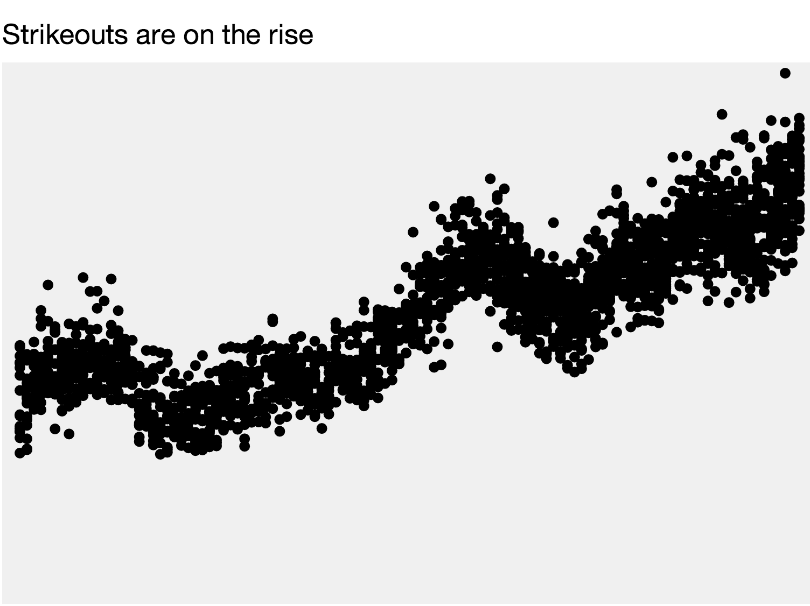

##Housekeeping
- [Project timeline.](../../projects/) Are you on track for success?
- Peipei and Ellis are leading a discussion on [XXX]()

##Lab
Say you're a sports reporter covering the Oakland Athletics and you heard one of your sources talk about a shift in the way the game is played. Your source, a batting coach, says he tells his hitters to swing aggressively no matter the pitch count – in the past, he had told them to be more defensive when they had two strikes, opting to put the ball in play rather than strike out. As a result, your source says, players are striking out much more than they used to: last year, the team struck out more than than any time in franchise history.

As a journalist who's literate with data, what might be a logical way to assess the veracity of this claim and provide insight on this trend to your readers? Where might you get data to prove or disprove this claim?

###D3

Hopefully you already have a `line-chart` repo with a `gh-pages` branch setup and have create an `index.html` file that is based on <a href="http://alignedleft.com/tutorials/d3/setup">Scott Murray's d3 starter</a>. If not, do all that now or ask a friend to help.

1. First thing's first. Let's create a place for our CSS, a headline for our page and an empty container for our shiny chart. We'll also need a `script` tag for all our fancy javascript.

  ```html
  <style>
      /* Our css will go here */
  </style>

  <h1>Strikeouts on the Rise</h1>
  <p>Meaningful intro sentence here.</p>
  <div class="chart"></div>

  <script>
      // Our javascript code will go here
  </script>
  ```

2. You should already have your `strikeouts.csv` file in your repo, so let's try to load it up.

  ```javascript
  d3.csv("strikeouts.csv", function(data){
      console.log(data);
  });

  ```

3. Now, some of our number fields are coming through as strings, so let's fix that. Your javascript should look like this. Now the number fields should look like numbers in the console.

    ```javascript
    d3.csv("strikeouts.csv", function(data){
        data.forEach(function(d) {
            d.so = +d.so;
            d.year = +d.year;
            d.g = +d.g;
            //We also want to calculate the strikeouts per game and store it as a new column
            d.kpg = d.so / d.g;
        });
        console.log(data);
    });
    ```

4. We'll start by making a scatterplot, for which we'll need two scales. First we need svg element to put our chart into.

    ```javascript
    var svg = d3.select(".chart")
            .append("svg")
            .attr("width", 900)
            .attr("height", 500);
    ```


5. Now we'll need an `xScale`...

    ```javascript
    var xScale = d3.scale.linear()
          .domain([1900, 2012])
          .range([0, width]);
    ```
5. And now the `yScale`...

    ```javascript
    var yScale = d3.scale.linear()
          .domain([0, 100])
          .range([0, height]);
    ```

6. And now for the magical data join

    ```javascript
    svg.selectAll(".dot")
          .data(data)
      .enter().append("circle")
          .attr("class", "dot")
          .attr("r", 5)
          .attr("cx", function(d, i) { return xScale(d.year); })
          .attr("cy", function(d) { return yScale(d.kpg); })
    ```
7. You should see something like this:
    

    Not great, but a start. Let's fix our `yScale` so our data fits better and so it's pointed the right way.

    ```javascript
        var yScale = d3.scale.linear()
          .domain([0, 10])
          .range([height, 0]);
    ```

    Here we've switched the range values and hardcoded a better max for our domain. If you want to get fancy, we can calculate that max value with:

    ```javascript
    .domain([0, d3.max(data, function(d) { return d.kpg; })])
    ```

    but that is optional. Either way, it should look something like this:

    

    Try reducing the `"r"` attribute of your circles to `2` and see what happens.

8. Right now we're showing all teams for all years, so let's now filter our data and just show Oakland. Here's how to show New York Yankees, modify it to show Oakland A's.

    ```javascript
    var nyData = data.filter(function(d) { return d.franchise === "NYY"; });
    ```

    Here we're creating a new data variable `nyData` so we also need to make sure our data join is using this variable and not `data`.

    ```javascript
    svg.selectAll(".dot")
          .data(nyData)
          //...
    ```

    You should now only see the dots for Oakland.

9. The title of this lesson is "line chart" not "scatterplot" so let's get at least one line in there.

    The weird thing about svg is that a complicated line is actually one element --- as opposed to the circles where there is a circle element for each data value. For a line there will be only one element for ALL our data values.

    So, first thing we need to do is create something that is called a `d3.svg.line()` generator.

    ```javascript
    var line = d3.svg.line()
        .x(function(d) { return xScale(d.year); })
        .y(function(d) { return yScale(d.kpg); });
    ```

    This creates a function for us that we are saving as `line` and this function will take a data set and spit out the proper code to make an svg path element. Here's how we use it:

    ```javascript
    svg.append("path")
      .attr("d", line(nyData));
    ```

    

    What this is doing is creating a `path` svg element and adding the `d` attribute with all our magic line code. Unfortunately it looks a little funky because it has a fill and no stroke, so let's fix that with CSS.

10. Add this CSS style rule to the `style` area of your page and add a class to the path element
    ```javascript
    svg.append("path")
      .attr("class", "line")
      .attr("d", line(nyData));
    ```

    ```html
    <style>
      .line {
        fill: none;
        stroke: magenta;
      }
    </style>
    ```
11. We should probably start labeling some stuff now. Let's start with an axis.

    Similar to the line generator, we need to now create an axis generator (which won't actually create an axis, only create the function to create an axis. Mind blown.)

    ```javascript
    var xAxis = d3.svg.axis()
        .scale(xScale);
    ```

    Now, let's use this generator to generate some svg code.

    ```javascript
    svg.append("g")
      .attr("class", "axis")
      .call(xAxis);
    ```

    The axis should show up, but it'll look super janky and be on the top of the page and the numbers are weird and it get's cut off. Let's tackle these one at a time.

12. The <a href="http://bl.ocks.org/mbostock/3019563">D3 margin convention</a> is there to help with the cutoff problem. We cut some corners and just appended an svg element at the start instead of setting things up proper, so let's take a step back. Up where we appended our "svg", let's replace it with this code:

    ```javascript
    var margin = {top: 20, right: 20, bottom: 20, left: 20};
        width = 750 - margin.left - margin.right,
        height = 500 - margin.top - margin.bottom;

    var svg = d3.select(".chart").append("svg")
        .attr("width", width + margin.left + margin.right)
        .attr("height", height + margin.top + margin.bottom)
      .append("g")
        .attr("transform", "translate(" + margin.left + "," + margin.top + ")");
    ```

    You should now be able to see your entire axis text.

13. Let's move the axis to the bottom of the page. Right now it's in a `g` element, which is a group, so we can just move that around. Unfortunately you can't just use x and y. Instead you have to use a "transform"

    ```javascript
    svg.append("g")
      .attr("class", "axis")
      .attr("transform", "translate(0, " + height + ")")
      .call(xAxis)
    ```
14. Next on our list, the labels have weird commas in them, which would be nice if they were numbers, sadly ours are years. D3 is formatting our numbers for us, but we need to override that.

    ```javascript
    var xAxis = d3.svg.axis()
        .tickFormat(function(d) { return d; })
        .scale(xScale);
    ```

15. The rest of our fixes can be made with CSS. Inspect element on the axis component and see what's what. Inside there should be a bunch of `g` elements with `.tick` classes and one `.domain` element. First, let's style the `.domain` element.

    ```css
    .domain {
        fill: none;
        stroke: cyan;
    }
    ```

    Now, let's make those ticks show up.

    ```css
    .tick line {
        stroke: cyan;
    }
    ```

    And let's make the text size a little smaller

    ```css
    .tick {
        font-size: 10px;
    }
    ```

    You should now have something like this:

    

16. Final step, bring some fun. (just copy and paste this into your code)

    ```javascript
    d3.select(".chart").append("button").text("Blamo!").on("click", function() {
        d3.selectAll("circle")
            .transition()
            .duration(2000)
            .ease("bounce")
            .delay(function(d, i){ return i * 50})
            .attr("cy", height)
            .attr("r", 7);
    });
    ```

17. Here's a link to a working version: <a href="d3-line-chart.html">d3-line-chart.html</a>


##Homework
Your assignment is to publish a line chart with this data in D3 of your favorite team. It's due **Tuesday at noon.** It doesn't have to look like [the NYT version](http://www.nytimes.com/interactive/2013/03/29/sports/baseball/Strikeouts-Are-Still-Soaring.html?_r=0), but it might help you figure out some of the code (or not - it is pretty complex):


As we've said, grading isn't the most important thing in the world to us, but here are our expectations.

####Requirements
- It must be published on its own github branch and linked to from your dataviz-home page.

- It must have a line representing the average strikeouts per game of a team of your choosing, along with a title and an X and Y axis.

- It must have at least one meaningful annotation describing any trends or insights. Some are on the NYT version already, we know, so try to annotate the line for your team.

####For a gold star

- Try to have a select element or search box that lets you choose from any team in the league (if we don't do this in class) and the line redraws based on your selection.

- Add a line for the league average calculated using d3.nest()

- Add another chart and copy that tells a more specific story, or do more reporting based on data analysis you've done here.

- Clean up the design of your chart using CSS based on successful line charts you've seen in the wild. [There](http://www.nytimes.com/interactive/2011/05/31/business/economy/case-shiller-index.html) [are](http://www.nytimes.com/interactive/2012/10/05/business/economy/one-report-diverging-perspectives.html) [lots](http://www.nytimes.com/interactive/2013/01/15/us/a-migration-of-unmarried-men.html) [of](http://www.nytimes.com/interactive/2012/05/05/sports/baseball/mariano-rivera-and-his-peers.html) [examples](http://www.nytimes.com/interactive/2012/11/30/us/tax-burden.html).