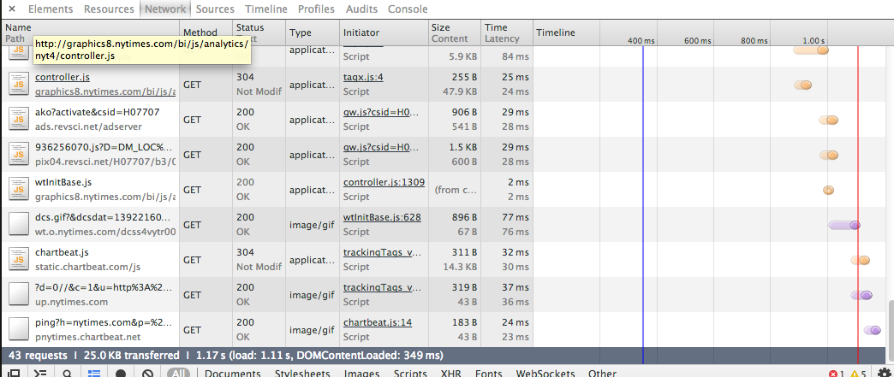

For many data journalism projects, the Census, BLS, state governments and academics provide plenty of interesting data. But they aren't the only places to find it, and sometimes it's in a form you might not be used to. Today, we'll go over some non-excel data sources and practice fetching data out of them.


## Housekeeping
We should probably talk about [your projects](../../projects/).

## Discussion:
We talked a little bit last class about how interesting and fun data journalism is also more creative than you might think. Some more examples.

- What the NYT [thinks of Twitter](http://qz.com/130189/the-complete-history-of-twitter-as-told-through-tortured-descriptions-in-the-new-york-times/)

- [Things the NYT has called a "guilty pleasure"](http://6thfloor.blogs.nytimes.com/2014/02/07/22-things-the-new-york-times-has-called-a-guilty-pleasure/)

- What people in Denver [preferred doing](https://twitter.com/nxthompson/status/430536058858528768) instead of the Super Bowl

- What people [read about](http://www.slate.com/articles/life/culturebox/2014/01/wikipedia_s_penis_and_vagina_pages_their_colorful_history_and_popular_present.html) on Wikipedia

- U.S. [adoption records](http://adoption.state.gov/about_us/statistics.php) for every country in the world.

- It doesn't have to be [too analytical](http://nymag.com/thecut/2014/02/here-are-cities-where-women-earn-the-most-money.html), either.

What's the mindset behind these? How can you apply that thinking to your own work? Think about the thought process behind these – what do they have in common?

Or, another way, try to re-create the thinking behind how one of these gets made.

## Get to know your Web inspector
The [inspector](https://developers.google.com/chrome-developer-tools/) in Chrome is an extremely useful tool for all sorts of functions; today we'll mess around with it on some popular web sites.



We'll test for Javascript libraries like D3 and Jquery and do some basic looking around in the Elements, Network and Console panels. We'll play with CSS, write some Javascript; mostly, though, we'll use it to find out where some data lives. In short, the inspector does much more than just let you experiment with CSS. It also lets you see every asset your web page is loading &mdash; even when you can't see it.

## Having a hunch data has an external source.
Most of the time, if you get the impression a human didn't create the internet page you are reading from scratch (like this one), there's a good chance it was generated in a structured way, which means you can usually get it out in a structured way. If there's one lesson from today, it's that almost without exception, **if the data was generated in a structured way, you can usually get it out in a structured way**.

It can be in many different kinds of structure – plain old text, JSON, XML, HTML tables, even PDFs. Find and download the data behind these.

- The [franchise history](http://www.baseball-reference.com/teams/MIN/) of the Minnesota Twins baseball club.

- Find a local [community pharmacy](http://www.ncpanet.org/index.php/find-your-local-pharmacy). (Don't search too many times; we've broken this Web site before.)

- Flash maps still [load data](http://transform.mo.gov/map/) behind the scenes.

- Every [4th down](http://www.nytimes.com/newsgraphics/2013/11/28/fourth-downs/team.html?teamid=MIN) the Minnesota Vikings football team had in 2014, analyzed.

- Bust kids [cutting corners](http://erikreyna.github.io/chicago/) on their homework. (See [this map](http://www.nytimes.com/interactive/2013/01/29/us/where-50000-guns-in-chicago-came-from.html))

Now install [this Chrome extension](https://chrome.google.com/webstore/detail/jsonview/chklaanhfefbnpoihckbnefhakgolnmc) and check out the 4th down data again.

##Helpful tools.
- Let's use [Tabula](http://tabula.nerdpower.org/), to fetch data from a pdf table (if it doesn't cut-and-paste easily). Let's use them in a real-world example of the gross format data really comes in with an [archived list](http://cooktemp.dreamhosters.com/races/senate/ratings.php) of Cook Political Report's historical race ratings.

- [DownThemAll](https://addons.mozilla.org/en-US/firefox/addon/downthemall/) lets you cheat/fake scrape.


## A very basic scraper

- Google for a database of zip codes.

- In excel, generate a column that looks like this:

	```html
	<a href = 'http://www.fight4rx.org/map/getpharms3.php?address=11201'></a>11201</a>
	```

- Copy 10 of your links into a new html file.

- Install a Firefox add-in called "[DownThemAll!](http://www.downthemall.net/)"

- Download your 10 links into a new folder.

- CD into your folder and copy and paste the following:

	```
	for file in *.html
	do
	  cat "$file"
	  echo
	done > pharma.txt
	```

- Open pharma.txt in a text editor. Replace ```},``` with ```\n``` using regular expressions and save your file.
- Open pharma.txt in Excel and use text to columns
- Watch out for duplicates in your data.


There are tons of resources out there to automate data collection – this is just (a very cheap) one. Most of them require a little more programming than this one, but it's almost always worth the effort. Here's a handy tipsheet from [Scott Klein and Michelle Minkoff](https://github.com/kleinmatic/datashow).

##Homework

Give these a read for next time

- [Get to know your web inspector](http://ruby.bastardsbook.com/chapters/web-inspecting-html/)

- [Teaching debugging](http://danluu.com/teach-debugging/)

- Why we don't give too much homework. How to start [learning to program](http://www.propublica.org/nerds/item/how-to-start-learning-how-to-program).

- For people who want to do more scraping on their own, try [this guide](http://ruby.bastardsbook.com/chapters/html-parsing/) using Nokogiri, a Ruby gem.