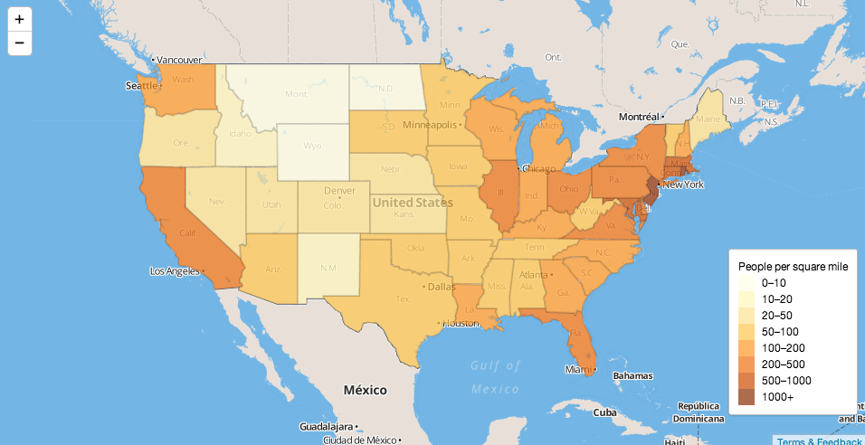

We'll do normal first-day things, like talk about why we‘re all here and what we want. Class goals and policies, introductions, office hours, grading policies, project overview, configuring our laptops, signing up for tutorial and presenation duty.

Finally, we'll get inspired by some code we see online and use it for a quick demonstration.


##Housekeeping

-   Make sure your info is right on the [wiki](https://github.com/kpq/nyu-data-journalism-2014/wiki/Class-wiki)
-   Are you sure you've signed up for the [Google group](https://groups.google.com/forum/#!forum/nyu-data-journalism-2014)?

##Introduction

How Amanda Got Started [Intern](http://d.pr/i/XrmI) [Delightful boxes](http://www.nytimes.com/packages/html/newsgraphics/pages/hp/2008/2008-06-03-1800.html) [The dots are real](http://www.nytimes.com/interactive/2013/06/12/arts/design/Damien-Hirsts-Spot-Prices.html?_r=3&)

How Kevin Got Started [Grad school](http://www.columbiamissourian.com/m/1497/weve-got-to-have-more-corn-expert-says/) [Intern](http://www.nytimes.com/interactive/2008/05/26/sports/playmagazine/200805227_IVANOVIC_GRAPHIC.html) [Peaked](http://www.nytimes.com/interactive/2012/08/05/sports/olympics/the-100-meter-dash-one-race-every-medalist-ever.html)

[2013: The Year in Interactive Storytelling](http://www.nytimes.com/newsgraphics/2013/12/30/year-in-interactive-storytelling/)

[Learn to think like Amanda](http://chartsnthings.tumblr.com/post/23348191031/amanda-cox-and-countrymen-chart-the-facebook-i-p-o)

Discussion: 

- What do you all want to get out of the class?

- What kinds of jobs are you going to be looking for?

- What has been missing so far in your journalism education?

##Getting your machines set up

1. Everyone should download a **text editor** to their laptop, if they have one. 

  For Mac users, we strongly recommend [Sublime Text 2](http://www.sublimetext.com/2). It eventually costs $70, but you can use it for free for a while. (Kevin still uses the free version and he uses it every day.) Other alternatives include [TextWrangler](http://www.barebones.com/products/textwrangler/) (free) or [BBEdit](http://www.barebones.com/products/bbedit/) (not free).

  PC Users might consider [Notepad++](http://notepad-plus-plus.org/).

2. Next, we need to make sure Git is installed on all our computers. Here's [a helper](http://git-scm.com/book/en/Getting-Started-Installing-Git). If you have a Mac, you probably have it installed already. We'll do this together.

###Signing up for Github
If you’ve never used <a href="http://git-scm.com/">Git</a> or <a href="https://github.com">Github</a> before, don’t worry, it’s not as scary as it may seem at first. It’s basically like <a href="https://www.dropbox.com/">Dropbox</a> for programmers, with enough goofy names and concepts to make it all feel a little more complicated than it really is.


1. First, go to <a href="https://github.com/">Github</a> and create a username and password, etc. 
  .

2. Once you are logged in, click on “Create a repository.” You should see this screen:
  
  Name your repo ```data-journalism-home```.
  Make sure you check “Initialize this repository with a README”.
  Finally, click the button that says ```Create repository.```
  
3. Switch the branch from ```master``` to ```gh-pages```. (It has to be called gh-pages to take advantage of some built-in magic with Github Pages.)
    

4. Copy the clone url on the bottom-right.
  

4. We've made a siccessful Git repository (called a repo). Nice! Now all we need to do is copy it to our computers. 

1. Go to your home directory, it’s the one in your sidebar with a house icon. Kevin's is called “kevin” and the keyboard shortcut to go there is: ⌘⇧H
  
2. Inside this folder, create a new folder called ```data-journalism-spring-2014```. This is where we’re going to store our repository (and, later on, where we'll put other ones).
    

3. Open up the Terminal application on your Mac and navigate to the folder you just created. (We'll do some practice, too.) For later, here are some decent resources, from [Codeacademy](http://www.codecademy.com/blog/72-getting-comfortable-in-the-terminal-linux) and [Stanford](http://mally.stanford.edu/~sr/computing/basic-unix.html).

4. Once you're "inside" your folder on the Terminal, type ```git clone``` and then the URL you pasted from earlier. (For Kevin, it's ```git clone https://github.com/kpq/data-journalism-home.git```), but yours will be slightly different.
  

5. Open up the folder in a text editor (like Sublime or whatever you prefer). Create a new file called ```index.html``` and write 

  ```html
  <h1>Hello, world!</h1>
  ```  

6. Save the file and view it in a web browser. How does it look?

7. Let's use git and the Terminal to push it back to Github. Type this in the Terminal. (Hit enter after each line.)

  ```html

  git add .
  git commit -m "added index page, this is a commit message"
  git push origin master

  ```

8. If it worked, you should be able to go to your web page (github.com/yourUserName) and see the result. And, after a while, if you're on the gh-pages branch, you shoudl have a public-facing web site on yourUserName.gitub.io/. Sweet!

##If there's time: using an online example.
Say you want to make an interactive map of the United States and you don't know where to start, but you DO know what you want your map to look and behave pretty much like [this one](http://bl.ocks.org/ansis/9368682874d9e8adda21) you've already seen. 



What's next?

1. Open the page in a separate window and view the page source.
2. Copy all the code and paste it into a new file in your text editor. Call it ```week-1-map.html``` and save it into your class folder.
3. Open the file in a browser.
4. Say your data is not people per square mile but something else per state – say, dollars raised for a political campaign. Where does this map get that data from?

5. If you can, find the data and save a local copy. Then edit the data for New York and see what happens.

6. Broadly speaking, how can you use this example going forward?


##Homework

Your only real assignment is to have your github page publishing correctly before the next class. For now, that means yourusername.github.io should be rendering your `index.html` page with your name and the phrase "Useful links for Kevin and Amanda." (We'll be adding more links later.)


