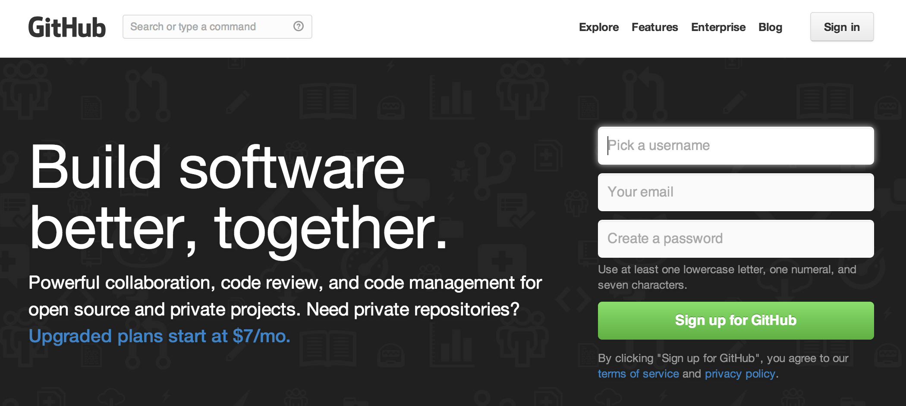

We'll do normal first-day things, like talk about why we‘re all here and what we want. Class goals and policies, introductions, office hours, grading policies, project overview, configuring our laptops, signing up for tutorial and presenation duty.

Finally, we'll get inspired by some code we see online and use it for a quick demonstration.


##Housekeeping

-   Make sure your info is right on the [wiki](https://github.com/kpq/nyu-data-journalism-2014/wiki/Class-wiki)
-   Are you sure you've signed up for the [Google group](https://groups.google.com/forum/#!forum/nyu-data-journalism-2014)?

##Introduction

How Amanda Got Started [Great link #1](http://www.google.com) [Great link #1](http://www.google.com) [Great link #1](http://www.google.com)

How Kevin Got Started [Great link #1](http://www.google.com) [Great link #1](http://www.google.com) [Great link #1](http://www.google.com)

[2013: The Year in Interactive Storytelling](http://www.nytimes.com/newsgraphics/2013/12/30/year-in-interactive-storytelling/)

[Process walkthrough TBD – could be China art, 4thbot, whatever](http://www.google.com)

Discussion: 

- What do you all want to get out of the class?

- What kinds of jobs are you going to be looking for?

- What has been missing so far in your journalism education?

##Getting your machines set up

1. Everyone should download a **text editor** to their laptop, if they have one. 

  For Mac users, we strongly recommend [Sublime Text 2](http://www.sublimetext.com/2). It eventually costs $70, but you can use it for free for a while. (Kevin still uses the free version and he uses it every day.) Other alternatives include [TextWrangler](http://www.barebones.com/products/textwrangler/) (free) or [BBEdit](http://www.barebones.com/products/bbedit/) (not free).

  PC Users might consider [Notepad++](http://notepad-plus-plus.org/).

2. Next, we need to make sure Git is installed on all our computers. Here's [a helper](https://help.github.com/articles/user-organization-and-project-pages), but we'll do this together, too.


###Signing up for Github
If you’ve never used <a href="http://git-scm.com/">Git</a> or <a href="https://github.com">Github</a> before, don’t worry, it’s not as scary as it may seem at first. It’s basically like <a href="https://www.dropbox.com/">Dropbox</a> for programmers, with enough goofy names and concepts to make it all feel a little more complicated than it really is.


1. First, go to <a href="https://github.com/">Github</a> and create a username and password, etc. 
  .

2. Once you are logged in, click on “Create a repository.” You should see this screen:
  
  Name your repo ```data-journalism-home```.
  Make sure you check “Initialize this repository with a README”.
  Finally, click the button that says ```Create repository.```
  
3. Switch the branch from ```master``` to ```gh-pages```. (It has to be called gh-pages to take advantage of some built-in magic with Github Pages.)
    

4. Copy the clone url on the bottom-right.
  

###Installing git
1. [This maybe](http://git-scm.com/book/en/Getting-Started-Installing-Git)

3. You’ve just intialized a Git repository! Nice. Now we need to copy it to our computers.

1. Go to your home directory, it’s the one in your sidebar with a house icon. Kevin's is called “kevin” and the keyboard shortcut to go there is: ⌘⇧H
  
2. Inside this folder, create a new folder called ```data-journalism-spring-2014```. This is where we’re going to store our repository (and, later on, where we'll put other ones).
    

3. Open up the Terminal application on your Mac and navigate to the folder you just created. (We'll do some practice, too.) For later, here are some decent resources, from [Codeacademy](http://www.codecademy.com/blog/72-getting-comfortable-in-the-terminal-linux) and [Stanford](http://mally.stanford.edu/~sr/computing/basic-unix.html).

4. Once you're "inside" your folder on the Terminal, type ```git clone``` and then the URL you pasted from earlier. (For Kevin, it's ```git clone https://github.com/kpq/data-journalism-home.git```), but yours will be slightly different.
  

  
<!-- 


###Installing Github on Your Computer
Now you’ll need the Github application on your computer so you can edit and sync your projects.
1. Download and install the Github application. <a href="http://mac.github.com/">Mac</a> or <a href="http://windows.github.com/">Windows</a>.
  <a href="http:mac.github.com"></a>
  (If you get stuck in the future, there are good help pages for <a href="http://mac.github.com/help.html">Mac</a> and <a href="http://windows.github.com/help.html">Windows</a>.)
  
1. After installing, when you first launch the application it will ask you to move it to the Applications folder. Say “yes”.
  
1. When it re-launches, it’ll step you through a setup process. You’ll need to enter your shiny new Github credentials, you’ll want the command-line tools, but you don’t need to “add local repositories”.
  
1. You should now see a window that lists one repository: “dataviz-home”. Click the button next to it that says “Clone to Computer”.
    
  
1. A dialog window will popup. Navigate to your “dataviz-fall-2013” folder in your home directory. Click “Clone”.
  
  
1. Click on the little arrow next to your repo name and you now can see the whole edit history for that repo. You should only have one entry, and it’ll be called “Initial Commit”.
  
  
1. Now, go back to the Finder and find your home directory. There should be a folder within “dataviz-fall-2013” called “dataviz-home”, with one file inside of it.
  
 -->