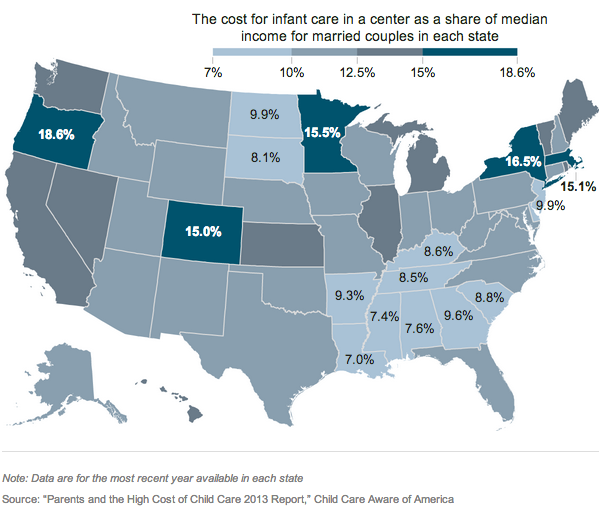

We'll try to form something closer to a coherent whole out of what we've learned so far. And then we'll practice interviewing spreadsheets.

## Housekeeping
- Sign up for a critique date, in twos or threes, on the [critique schedule wiki](https://github.com/kpq/nyu-data-journalism-2014/wiki/Critique-Schedule)
- And, seriously, if your info is not right on the [main wiki](https://github.com/kpq/nyu-data-journalism-2014/wiki/Class-wiki), you are not on track for success.

## Critique + Discussion: 
- Lilah and Erin
- Your reading homework from last week.
- Some scraping things we might have talked about include [WNYC's school attendance work](http://www.wnyc.org/story/school-was-open-most-parents-kept-students-home/) and [hiding failure](http://misener.org/kickstarter-hides-failure/)
- [The essence of programming](https://twitter.com/fjsteele/status/434249935316615168/photo/1)
- The Data Journalism Handbook includes a nice list of [types of data journalism stories.](http://datajournalismhandbook.org/1.0/en/understanding_data_5.html)

## Putting the pieces together

Here is some data on <a href = "child-care-costs.xlsx">child care costs</a>. Let’s pretend we want to make a map to help with our analysis.

- Format the data to be ready for analyis, and possible merging with other datasets. This means the first row has headers, ideally without any spaces or special characters, and the state names are as normal as possible. A hint: you may want to google something like "replace asterisks in excel." 

- Remember [this guy](http://bl.ocks.org/ansis/9368682874d9e8adda21)? Copy the code to your text editor, and reaqquaint yourself with how the colors get assigned.

- On the first line of the getStyle function add the following: <code>console.log(feature.properties)</code>

- Turn your data into JSON properties with [Mr. Data Converter](http://shancarter.github.io/mr-data-converter/). 

- In your code, add   <code>var childCare = </code>  and the result from Mr. Data Converter. 

- After that, add  <code>var childCareDict  = {};</code>  and  <code>
childCare.forEach( function(row) { childCareDict[row.state] = row.child });</code> , 
using whatever header names you used. 

- Try something like <code>console.log(childCareDict["Oregon"]);</code>

- Figure out a way to change the colors on your map using childCareDict. It's okay to struggle for a little bit. <code style="background:white">fillColor: getColor(  childCareDict[feature.properties.name]  )</code> 

- Adjust your colors, then fix your rollover and your key. [ColorBrewer](http://colorbrewer2.org/) is a good resource for map palettes. And here's [a good place](http://www.macwright.org/2013/02/18/literate-jenks.html) to start when thinking about breaks.

- If you are ahead, turn your map into something resembling journalism, with, say, a headline, and some sentences. A very rough example is <a href="map.html">here.</a> Notice that I switched to maptiles that don't scream "here's where the oceans are." You can do the same thing to Fusion table maps with [saturation](http://fusion-tables-api-samples.googlecode.com/svn/trunk/FusionTablesLayerWizard/src/index.html).

- Push your map to your github account, and add a link from your index page. Let's make sure we're all using the tab key in Sublime Text and terminal to our advatange.

##Looking at data

So far, we haven't really done any journalism. That's okay, because, as Nietzsche said, 
<blockquote>
He who would learn to <a href = "http://1.bp.blogspot.com/-IkhIk3TKD_Q/TwukDXh-FXI/AAAAAAAAAcQ/kAFlf9Jrtx0/s400/image012.jpg">fly</a> one day must first learn to stand and walk and run and climb and dance; one cannot fly into flying.
</blockquote> 

But it's about that time.

The typical graduation rates reported for colleges are broken, in part because tranfer students are counted in the same way as drop-outs. How could you fix this? 

- Some schools voluntarily give their progress data to a group called [College Portraits](http://www.collegeportraits.org/). Here is a [sample report](http://www.collegeportraits.org/SC/USC-Upstate/tracker). But even friendly people associated with that project don't know they have the data in a database. I suspect they do, but I'm not sure. I have scraped the data, and done some work to standardize it for you [here](college-grad-and-transfer-rates.xlsx). For the extra curious, here is some [horrible code](collegeportraits.r).

- Note that there are some small difference between the [2013 reports](http://www.collegeportraits.org/AL/AU/tracker) and the [2012 ones](http://www.collegeportraits.org/AL/JSU/tracker).

- Take 20 minutes to explore the data, generating a list of questions, facts, and weirdness you uncover [here](https://docs.google.com/document/d/1QVt45d0JfwLfa0RQtjULr68jZeWFKqEN6Ij4RU5sGVY/edit#). Your goal is questions that are both answerable and could turn into interesting ledes. 

- Let's come up with a gameplan for collecting the data for the biggest schools. What do we need? 

- Let's practice aggregating to see how far we have to go. Here's [something](list-of-schools.csv) for that. 

- In the doc with your questions, let's draft a request for data from a school.

##Homework

- Project pitches should be on the internet before next week's class.
- And, seriously, if your info is not right on the [main wiki](https://github.com/kpq/nyu-data-journalism-2014/wiki/Class-wiki), you are not on track for success.

