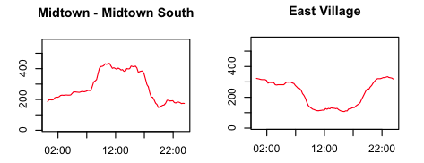

How do you interview a spreadsheet like a human being? Today, we'll work on turning a spreadsheet into a story, a source, a chart or something else journalistically valuable.

## Housekeeping
- Does everyone have a working github.io page?
-   Make sure your info is right on the [wiki](https://github.com/kpq/nyu-data-journalism-2014/wiki/Class-wiki)
-   Are you sure you've signed up for the [Google group](https://groups.google.com/forum/#!forum/nyu-data-journalism-2014)?

##Discussion: The data you brought

Please add a short description of the data you brought to class <a href = "https://docs.google.com/document/d/1QVt45d0JfwLfa0RQtjULr68jZeWFKqEN6Ij4RU5sGVY/edit">here.</a>

- Did anyone do anything interesing to collect their data? <a href="http://deadspin.com/infographic-is-your-states-highest-paid-employee-a-co-489635228">Doing the work</a> might get you somewhere interesting. 

- What format did you bring your data in? 

- Right now, how many of your datasets are really just about New York, California and Texas being big?

- If you were to present your data, what are some of the choices — like <a href="http://www.macwright.org/d3-curvy/">color</a> – that would affect how your readers interpret it? Here's a real-world example of how even-reasonable <a href="http://wonkviz.tumblr.com/post/68781802020/a-tale-of-two-choropleths">color choices matter.</a>

- How would you decide if your map <a href="http://www.ericson.net/content/2011/10/when-maps-shouldnt-be-maps/">shouldn't be a map?</a>

## Enough to make you dangerous

<table>
	<tr><td>Sort</td><td>Data menu &#8594; Sort</td></tr>
	<tr><td>Filter</td><td>Data menu &#8594; Filter</td></tr>
	<tr><td>Aggregate</td><td>Data menu &#8594; Pivot table</td></tr>
	<tr><td>Merge</td><td>=vlookup(...)</td></tr>
</table>

##Basic skills

Here is some data on <a href = "http://kpq.github.io/sherp-31/assets/data/drunkdrivingdeaths.xls">drunk driving deaths</a> in 2011.

1. Download the data to your computer, and open it in your spreadsheet program of choice. 
2. What were the 3 states with the most deaths? The 3 with the fewest?
3. Here is some data on <a href = "http://kpq.github.io/sherp-31/assets/data/statepopulation.xls"> population</a>. Add it to your spreadsheet using a function called <code>vlookup</code>. 
4. What were the states with the highest rates? The lowest?
5. How many deaths occured in the South? What region of the country had the highest rate of deaths? Here are some <a href = "http://kpq.github.io/sherp-31/assets/data/nytnames.xls">region codes</a> that might help you. For practice, answer this question by using a <code>pivot table</code>. Pivot tables are one way to summarize data.

##Excel work doesn't have to look like it

Your job is to identify as many people as you can in the picture above.

1. The easiest people to identify in the picture should be the runners. From  the online <a href="http://boston-iframe.r.mikatiming.de/2013/?event=R&idp=999999117A7326000008693E&pid=start">results</a>, acquire a spreadsheet of the last runners to finish.

2. Here's a wrinkle: not everyone in the photo started at the same time. Here's what the race organizers have to say about that: "Red bibs (numbers 101 - 8,999) are assigned to Wave 1 (10:00 a.m.). White bibs (numbers 9,000 to 17,999) are assigned to Wave 2 (10:20 a.m.). Blue bibs (numbers 18,000 +) are assigned to Wave 3 (10:40 a.m.)."

3. Subtract 40 minutes from the finish gun off of everyone with a bib number less than 9000, and 20 minutes from everyone with a bib number from 9000 to 17999.

4. Make a list of runners to call. Put their first and last names into separate columns with some combination of "Data -> Text to columns" and find and replace.

5. Here's the <a href="http://www.nytimes.com/interactive/2013/04/22/sports/boston-moment.html">NYT take.</a>

 
##Basic skills when your data is bigger

A digression: sometimes data is published to the web, but, without context, it's hard to know whether it's interesting or not. Here's <a href = "http://schools.nyc.gov/AboutUs/data/Attendance.htm">an example</a> about 
<a href = "http://www.wnyc.org/story/fewer-faces-nyc-schools-after-storm/">NYC school attendance from WNYC.</a>
It's easy to pull down this data every day, but, pretty quickly, it's going to get big enough that you will regret any cheating / manual labor you might have done in our earlier exercises today.

1. See if you can find where the data that powers the <a href = "http://citibikenyc.com/stations">Citibike stations map</a> lives.

2. Here is the same <a href = "http://kpq.github.io/sherp-31/assets/data/bikes.csv">data</a> for every 15 minutes on Wednesday, June 5.

3. Filter the data to look at a single station.

4. What time of day are the fewest bikes available system-wide?

5. Add a column for which <a href = "http://kpq.github.io/sherp-31/assets/data/bike-neighborhoods.csv">neighborhood</a> each station belongs to, and answer the same question for Midtown South, the East Village, and another neighborhood of your choice. 

6. Why might you want to collect this data yourself instead of just asking CitiBike?

7. In the <a href = "https://docs.google.com/document/d/1QVt45d0JfwLfa0RQtjULr68jZeWFKqEN6Ij4RU5sGVY/edit">Google doc</a> we used earlier today, make a list of questions we could answer with this type of data, either by itself, or by joining it to other data. 

##Homework
